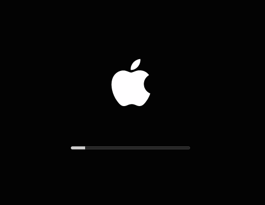

# DarkBoot
This script enables the black boot screen + white Apple logo on "unsupported" Macs.

### Information
**Note**: This may break in the future.

Confirmed working on:    
**10.10		(14A389)**
**10.10.1	(14B17)**

### How do I DarkBoot?
Download and run bootfix.command then restart twice.

### License?
Pretty much the BSD license, just don't repackage it and call it your own please!

Also if you do make some changes, feel free to make a pull request and help make things more awesome!